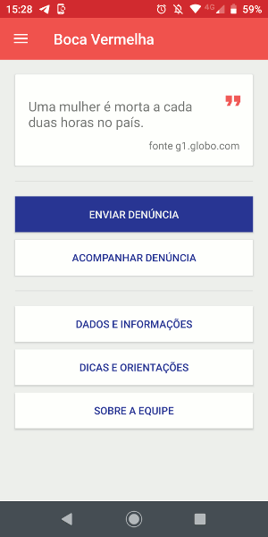

# Projeto Boca Vermelha
Sistema de denúncia de casos defeminicídio, assédio e violência doméstica desenvolvido como trabalho final para a disciplina **SSC0103 - Programação Orientada a Objeto**.

*Imagens do GIF .*

## Estrutura do Projeto e Tecnologias utilizadas

- **Banco de Dados:** 
  - *Oracle MySQL Server* para armazenamento de dados
  - *Oracle MySQL Workbench* para geração dos modelos relacionais
- **Web Service:**
  - *Java EE + Spring Boot + JDBC driver*
  - *Eclipse IDE for Enterprise Java Developers*
  - *Tomcat  v 9.0 Server*
- **Aplicação Android**
  - *Kotlin + Retrofitv2.6.0 + AnyChart v.1.1.2 (versão Free Trial)*
  - *Android Studio v 3.4.1*

## Como Configurar o Projeto
As informações do que se trata o projeto e como configurá-lo estão descritas no arquivo Relatório do Projeto.pdf.

## Autores 
Gabriel Van Loon & Giovani Lucafó & Alberto Neves & Tamiris Tinelli
